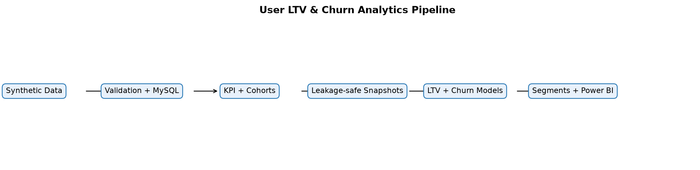
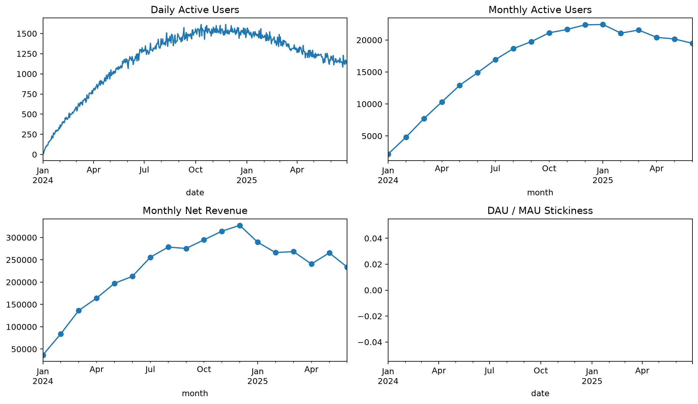
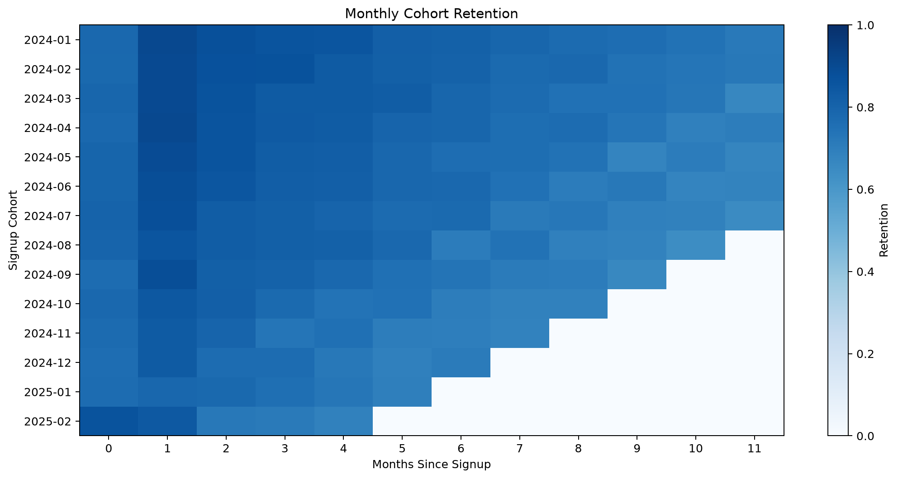
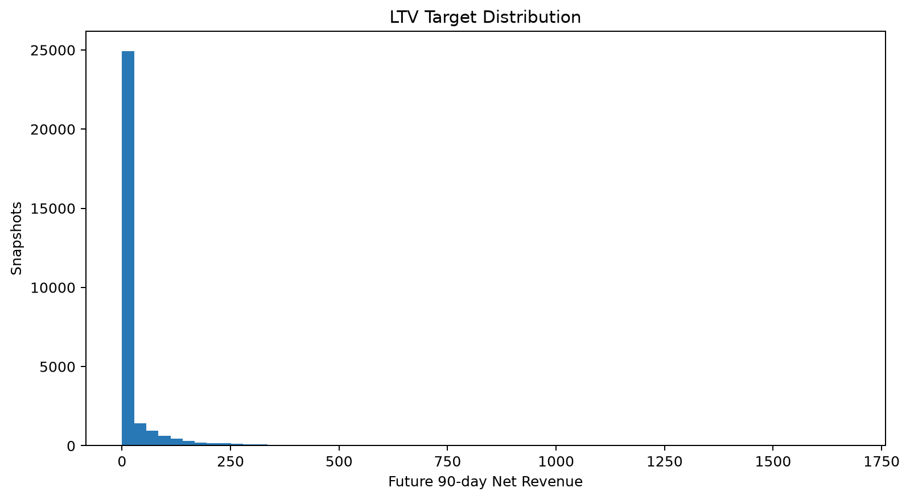
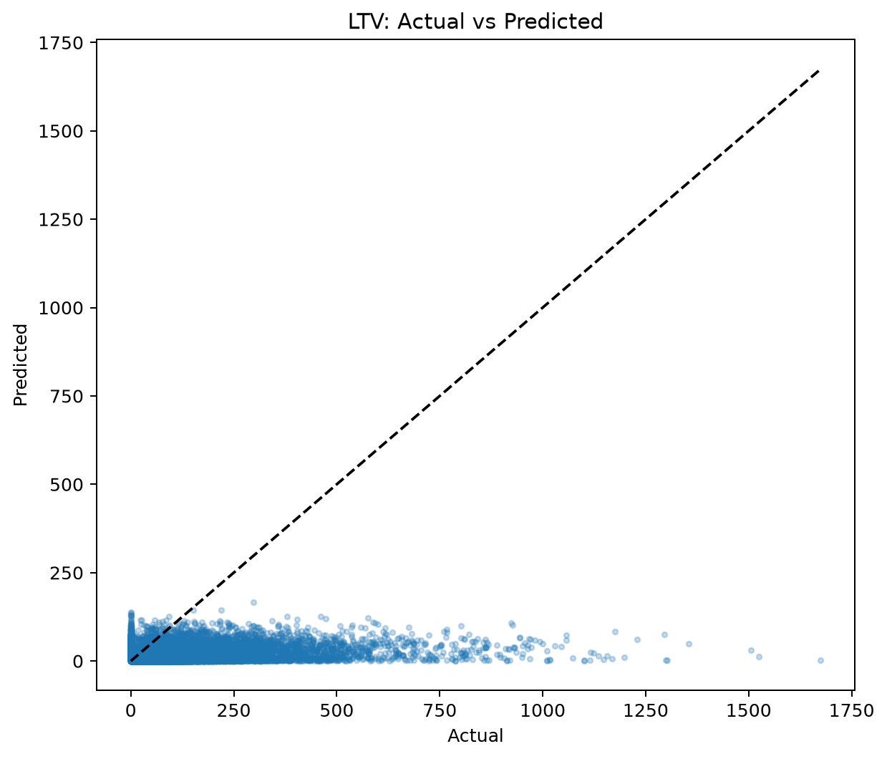
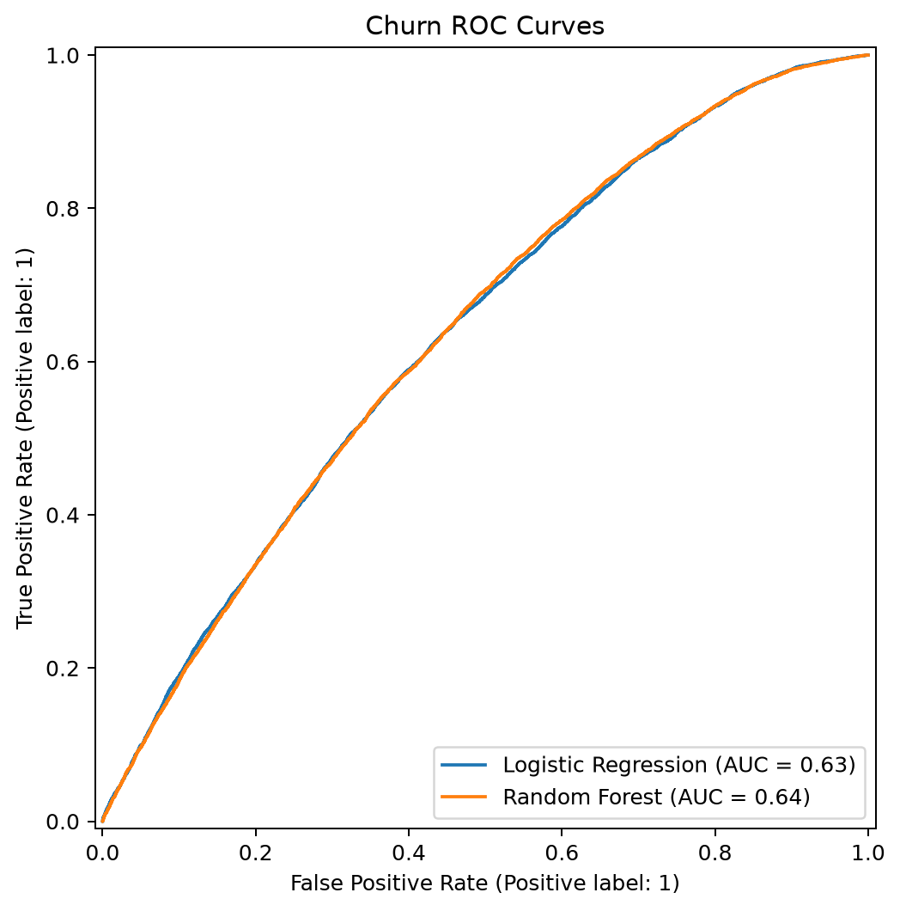
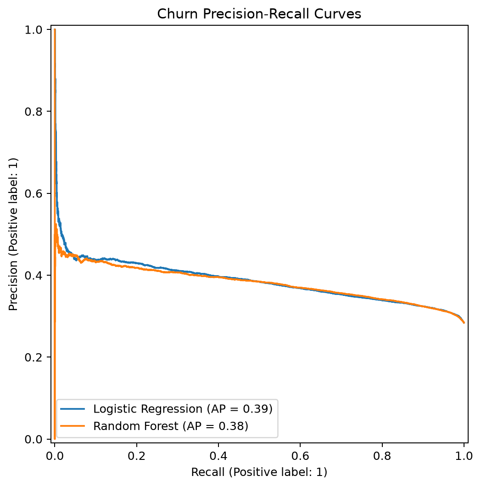
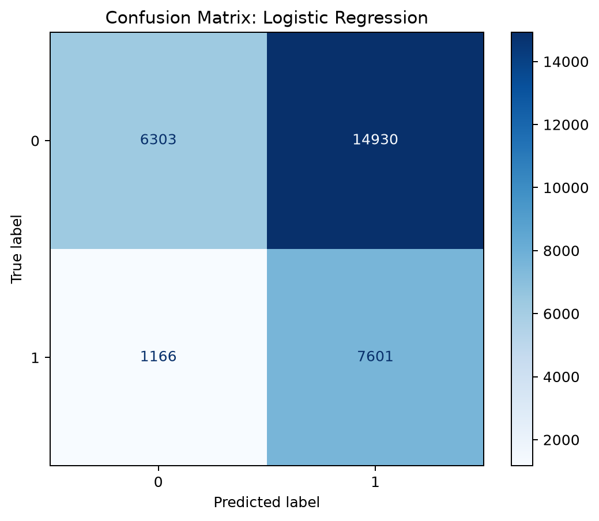
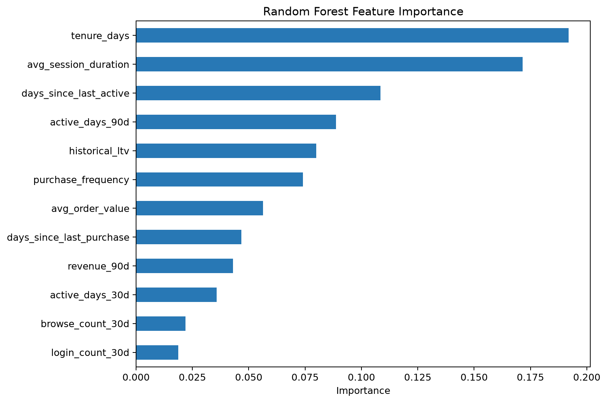
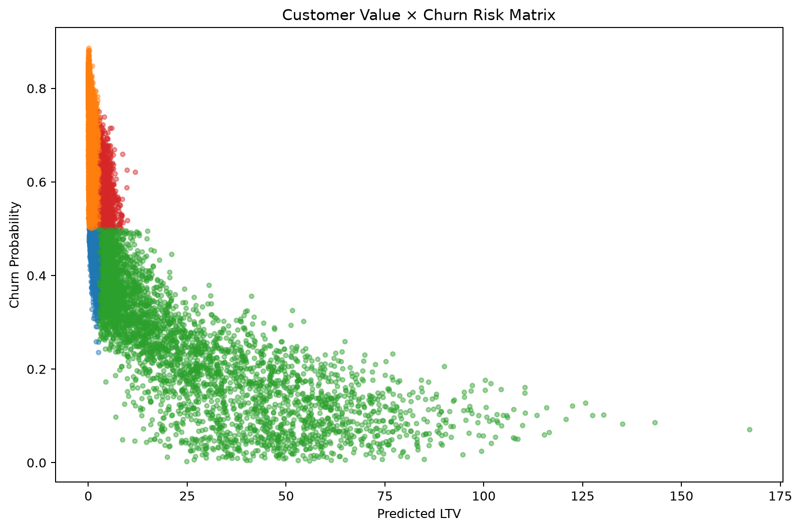

# User Lifetime Value Prediction & Churn Risk Analytics

[简体中文](README_zh-CN.md)

An end-to-end, reproducible analytics and machine-learning portfolio project built on a **synthetic dataset**. It demonstrates methodology and engineering practice; it does not represent any real company or customer data.



## Overview

The project turns 30,000 simulated customer histories into validated MySQL-ready tables, business KPIs, retention cohorts, leakage-safe monthly snapshots, LTV and churn predictions, actionable segments, and Power BI-ready exports. Every reported model number below was read from artifacts produced by the seeded pipeline run.

## Business Problem

Growth teams need to answer three connected questions: how healthy is engagement, which customers may leave, and where retention effort creates the most value. This repository links descriptive analytics to forward-looking predictions and an activation-oriented value × risk matrix.

## Architecture

`Synthetic data → validation → optional MySQL → KPI/retention → time snapshots → LTV/churn models → segmentation → Power BI CSV + figures`

Feature windows end strictly before `snapshot_date`; churn observes the following 30 days and LTV observes the following 90 days.

## Dataset

The seeded formal run contains 30,000 users, 671,174 events, and 44,960 orders from 2024-01-01 through 2025-06-30. Latent personas influence activity, decay, purchase frequency, order value, and refunds only during generation; they are never exposed to the models. Channel, onboarding, weekend, month, noise, and long-tail revenue effects are included.

Raw CSV files are ignored by Git and regenerated with:

```bash
python -m src.data.generate_data --users 30000 --seed 42
```

## Data Quality

Validation rejects duplicate/null user IDs, unknown foreign keys, pre-signup activity, negative session duration, non-positive order amounts, and refunds outside `[0, amount]`. Severe violations raise a clear `ValueError` and are covered by tests.

## KPI Framework

DAU, WAU, MAU, DAU/MAU, net revenue, ARPU, ARPPU, AOV, and paying rate are calculated in Python; equivalent MySQL queries are in `sql/04_analysis_queries.sql`. The formal run produced total net revenue of **$4,141,910.05**, average MAU of **16,583**, latest-month MAU of **19,486**, latest ARPU of **$12.00**, and latest paying rate of **11.55%**.



## Retention Analysis

Exact-day retention is D1 **15.52%**, D7 **15.24%**, and D30 **7.09%**. Monthly cohort, channel, and device outputs are generated for diagnostic analysis.



## Feature Engineering

Monthly rows include tenure, active days over 7/30/90 days, event counts, purchase counts, recent revenue, recency, session and order averages, purchase frequency, and historical LTV. Targets are explicitly excluded from `feature_columns()`.

## Time-based Split

Snapshots span 2024-07-01 to 2025-03-01. Earlier months train the models, the penultimate period validates/model-selects, and the latest period is held out for test. No random split is used and no post-snapshot behavior enters features.

## LTV Prediction

The target is future 90-day net revenue. Linear Regression and Random Forest train on `log1p(y)` and predictions are restored with `expm1`. The validation MAE selects the production candidate.




## Churn Prediction

`churn_30d = 1` means no valid event in the 30 days after the snapshot. Class-weighted Logistic Regression provides an interpretable baseline and Random Forest captures nonlinearity. Retention work prioritizes **Recall and PR-AUC**, not Accuracy alone, because missing a churner is costly and the classes are imbalanced.






## Model Evaluation

| Model | MAE | RMSE | R² |
|---|---:|---:|---:|
| Linear Regression | 25.894 | 86.940 | -0.073 |
| Random Forest | **25.281** | **82.324** | **0.038** |

| Model | Accuracy | Precision | Recall | F1 | ROC-AUC | PR-AUC |
|---|---:|---:|---:|---:|---:|---:|
| Logistic Regression | 0.477 | 0.333 | **0.842** | **0.477** | 0.638 | **0.385** |
| Random Forest | **0.556** | **0.356** | 0.699 | 0.472 | **0.638** | 0.381 |

The modest LTV R² and churn AUC are retained rather than beautified: zero-inflated future revenue, noisy behavior, and genuine overlap between latent personas make the task difficult. There is no evidence of suspicious near-perfect prediction.

## Customer Segmentation

The value cutoff is the 75th percentile (**$2.74**) of selected-model predictions on training snapshots; risk uses a predeclared 0.50 probability cutoff. Test outcomes were not used to tune either threshold.

| Segment | Recommended action | Users |
|---|---|---:|
| Priority Retention | Personal outreach and retention offer | 1,529 |
| VIP Maintenance | VIP benefits and cross-sell | 4,646 |
| Automated Reactivation | Automated win-back campaign | 20,656 |
| Growth/Nurture | Education and next-best-action nurture | 3,169 |



## Power BI

CSV exports, relationships, DAX measures, and a four-page design are documented in `powerbi/`: Executive Overview, Retention, Customer Value, and Churn Risk. Python does not fabricate a `.pbix` or screenshot. After building the report in Power BI, export it as `reports/figures/11_powerbi_dashboard.png`.

## Key Insights

- Engagement grows with the accumulating user base, while stickiness and cohort retention expose the quality behind headline MAU.
- D30 retention is materially below D1/D7, making longer-term reactivation a practical priority.
- The logistic model catches 84.2% of churners at the default cutoff, with the expected precision tradeoff.
- The largest activation pool is low-value/high-risk; expensive personal retention is reserved for the 1,529 high-value/high-risk users.

## Repository Structure

```text
config/                 reproducibility settings
data/{raw,interim,processed}/  generated artifacts (CSV ignored)
notebooks/              EDA, KPI/retention, model analysis
src/                    generation, validation, DB, analytics, features, models, segmentation, figures
sql/                    MySQL 8 database, tables, indexes, analyses
powerbi/                import guide, DAX, dashboard specification
reports/{figures,metrics}/     committed figures and real JSON metrics
tests/                  validation, analytics, leakage, models, segments
.github/workflows/      MySQL-independent CI
```

## Quick Start

```bash
python -m venv .venv
.venv\Scripts\activate
pip install -r requirements.txt
python -m src.pipeline --users 30000 --seed 42
pytest -q
```

Use `source .venv/bin/activate` on macOS/Linux. A smaller `--users 5000` run is useful for quick development.

## MySQL Setup

Copy `.env.example` to `.env`, replace credentials locally, then run `sql/01_create_database.sql`, `02_create_tables.sql`, and `03_indexes.sql` with MySQL 8+. This machine had no reachable MySQL service, so connection and bulk loading were **not falsely claimed as verified**; all SQL and client code are supplied, while CI remains database-independent.

## Reproducibility

All stochastic components use seed/random state 42. Paths derive from `pathlib`, source logic lives under `src/`, and the formal pipeline completed in **126.71 seconds** on a Windows CPU-only environment.

## Tests

`pytest -q` result: **11 passed**. Coverage includes integrity rules, time logic, KPI/retention calculations, leakage boundaries, target exclusion, both training workflows, and valid segmentation output. GitHub Actions installs dependencies and runs the same suite without MySQL or Power BI.

## Limitations

Synthetic behavior cannot reproduce every real-world confounder. Revenue is highly zero-inflated, model calibration is not production-monitored, acquisition attributes are not yet used in snapshot models, MySQL loading was not locally integration-tested, and the Power BI report must be assembled manually from the documented exports.

## Future Work

Add probability calibration and cost-sensitive thresholds, richer seasonality and promotions, survival/time-to-event models, uplift modeling for retention offers, drift monitoring, explainability, MySQL integration tests, and a completed Power BI artifact.

## Tech Stack

Python 3.10+, pandas, NumPy, scikit-learn, matplotlib, SQLAlchemy, PyMySQL, pytest, Jupyter, MySQL 8+, Power BI, and GitHub Actions.

## License

MIT — see [LICENSE](LICENSE).
