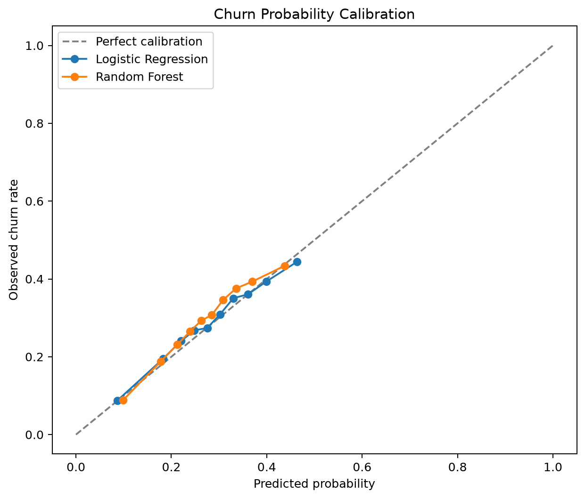
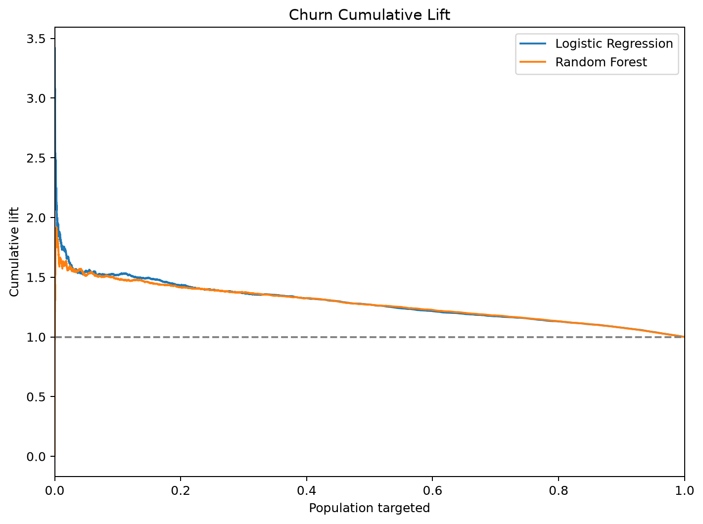

# User Lifetime Value Prediction & Churn Risk Analytics

[](https://github.com/xiaoyao12740/user-ltv-churn-analytics/actions/workflows/ci.yml)

[简体中文](README_zh-CN.md)

An end-to-end, reproducible analytics and machine-learning portfolio project built on a **synthetic dataset**. It demonstrates methodology and engineering practice; it does not represent any real company or customer data.


## Overview

The project turns 30,000 simulated customer histories into validated MySQL 8 tables, business KPIs, right-censored retention cohorts, label-maturity-aware snapshots, LTV and calibrated churn predictions, actionable segments, and Power BI-ready exports. Every reported number comes from the seeded formal pipeline artifacts.

## Business Problem

Growth teams need to answer three connected questions: how healthy is engagement, which customers may leave, and where retention effort creates the most value. This repository links descriptive analytics to forward-looking predictions and an activation-oriented value × risk matrix.

## Architecture

`Synthetic data → validation → KPI/right-censored retention → maturity-aware snapshots → LTV/calibrated churn → segmentation → Docker MySQL reconciliation → Power BI CSV + figures`

Feature windows end strictly before `snapshot_date`; churn observes the following 30 days and LTV observes the following 90 days.

## Dataset

The seeded formal run contains 30,000 users, 671,174 events, and 44,960 orders from 2024-01-01 through 2025-06-30. Latent personas influence activity, decay, purchase frequency, order value, and refunds only during generation; they are never exposed to the models. Channel, onboarding, weekend, month, noise, and long-tail revenue effects are included.

Raw CSV files are ignored by Git and regenerated with:

```bash
python -m src.data.generate_data --users 30000 --seed 42
```

## Data Quality

Validation rejects duplicate/null user IDs, unknown foreign keys, pre-signup activity, negative session duration, non-positive order amounts, and refunds outside `[0, amount]`. Severe violations raise a clear `ValueError` and are covered by tests.

## KPI Framework

DAU, WAU, MAU, DAU/MAU, net revenue, ARPU, ARPPU, AOV, and paying rate are calculated in Python; equivalent MySQL queries are in `sql/04_analysis_queries.sql`. The formal run produced total net revenue of **$4,141,910.05**, average MAU of **16,583**, latest-month MAU of **19,486**, latest ARPU of **$12.00**, and latest paying rate of **11.55%**.


## Retention Analysis

Exact-day retention is D1 **15.52%**, D7 **15.24%**, and D30 **7.09%**. Monthly cohort, channel, and device outputs are generated for diagnostic analysis. Cohort cells that have not reached the required observation period are `NaN`, not false 0% values; mature periods with no returning users remain 0%.


## Feature Engineering

Monthly rows include tenure, active days over 7/30/90 days, event counts, purchase counts, recent revenue, recency, session and order averages, purchase frequency, and historical LTV. Targets are explicitly excluded from `feature_columns()`.

## Time-based Split

Snapshots span 2024-07-01 to 2025-03-01. The single evaluation snapshot for both targets is **2025-03-01**. LTV trains on July–September 2024, validates on 2024-12-01, and applies a 90-day temporal embargo; churn trains through 2024-12-01, validates on 2025-01-01, and embargoes February. A row may train only when `snapshot_date + label_horizon <= model_as_of_date`. This prevents both feature leakage and the subtler use of labels that would not yet have matured at prediction time.

## LTV Prediction

The target is future 90-day net revenue. Zero, mean, and median predictors establish naive baselines. Linear Regression and Random Forest train on `log1p(y)`. A two-stage hurdle model estimates `P(positive revenue) × E(revenue | positive)`. Validation MAE selects the production candidate; the test set is never used for selection.


## Churn Prediction

`churn_30d = 1` means no valid event in the 30 days after the snapshot. Class-weighted Logistic Regression and Random Forest scores are calibrated with Platt scaling on validation data. The operating threshold is also selected on validation only; fixed 0.5 metrics remain in JSON as a baseline. Evaluation includes prevalence, no-skill PR-AUC, Brier score, Precision/Recall/Lift@Top10%, ROC-AUC, and PR-AUC.





## Model Evaluation

| LTV model | MAE | RMSE | R² |
|---|---:|---:|---:|
| Zero baseline | 25.341 | 87.729 | -0.091 |
| Mean baseline | 45.576 | 84.278 | -0.007 |
| Median baseline | 25.341 | 87.729 | -0.091 |
| Linear Regression | 25.673 | 87.636 | -0.089 |
| Random Forest (selected) | **25.060** | 82.517 | 0.035 |
| Two-stage hurdle | 35.009 | **73.604** | **0.232** |

| Model | Accuracy | Precision | Recall | F1 | ROC-AUC | PR-AUC |
|---|---:|---:|---:|---:|---:|---:|
| Logistic Regression (threshold 0.220) | 0.463 | 0.337 | **0.867** | 0.486 | 0.634 | **0.393** |
| Random Forest (threshold 0.215) | **0.469** | **0.339** | 0.863 | **0.487** | **0.635** | 0.389 |

Test churn prevalence/no-skill PR-AUC is **0.292**. Logistic PR-AUC is **0.393** (1.346× no-skill), Brier score is **0.197**, and Top-10% lift is **1.519×**. The hurdle model improves tail-sensitive RMSE and R² but loses on MAE, so the validation-selected production LTV model remains Random Forest.

## Customer Segmentation

The value cutoff is the 75th percentile (**$2.79**) of selected-model development predictions. The calibrated risk cutoff (**0.220**) maximizes validation F1. Test outcomes were not used to tune either threshold.

| Segment | Recommended action | Users |
|---|---|---:|
| Priority Retention | Personal outreach and retention offer | 1,517 |
| VIP Maintenance | VIP benefits and cross-sell | 4,565 |
| Automated Reactivation | Automated win-back campaign | 21,014 |
| Growth/Nurture | Education and next-best-action nurture | 2,904 |


## Power BI

CSV exports, relationships, DAX measures, and a four-page design are documented in `powerbi/`. Python does not fabricate a `.pbix` or screenshot. After building the report, export it as `reports/figures/13_powerbi_dashboard.png`.

## Key Insights

- Engagement grows with the accumulating user base, while stickiness and cohort retention expose the quality behind headline MAU.
- D30 retention is materially below D1/D7, making longer-term reactivation a practical priority.
- The calibrated logistic model catches 86.7% of churners at its validation-only threshold; its Top-10% risk list is 1.52× richer than random targeting.
- The largest activation pool is low-value/high-risk; expensive personal retention is reserved for 1,517 high-value/high-risk users.

## Repository Structure

```text
config/                 reproducibility settings
data/{raw,interim,processed}/  generated artifacts (CSV ignored)
notebooks/              EDA, KPI/retention, model analysis
src/                    generation, validation, DB, analytics, features, models, segmentation, figures
sql/                    MySQL 8 database, tables, indexes, analyses
powerbi/                import guide, DAX, dashboard specification
reports/{figures,metrics}/     committed figures and real JSON metrics
tests/                  validation, analytics, leakage, models, segments
.github/workflows/      MySQL-independent CI
```

## Quick Start

```bash
python -m venv .venv
.venv\Scripts\activate
pip install -r requirements.txt
python -m src.pipeline --users 30000 --seed 42
pytest -q
```

Use `source .venv/bin/activate` on macOS/Linux. A smaller `--users 5000` run is useful for quick development.

## MySQL Setup

Docker-backed MySQL 8.4 is implemented and locally verified:

```bash
docker compose up -d
python -m src.pipeline --users 30000 --seed 42 --mysql
set RUN_MYSQL_TESTS=1 && python -m pytest -q -m integration
```

The formal run loaded 30,000 users, 671,174 events, 44,960 transactions, and 228,350 snapshots. SQL/Pandas net revenue reconciled to **$4,141,910.05** within floating-point tolerance; row counts matched and both orphan counts were zero. Default unit tests and CI remain MySQL-independent.

## Reproducibility

All stochastic components use seed/random state 42. Paths derive from `pathlib`, and the formal 30k + MySQL pipeline completed in **274.85 seconds** on a Windows CPU-only environment.

## Tests

`pytest -q`: **17 passed, 1 integration test skipped**. With MySQL explicitly enabled: **1 integration test passed**. CI runs the unit suite on Python 3.10, 3.11, and 3.12 without MySQL or Power BI.

## Limitations

Synthetic behavior cannot reproduce every real-world confounder. Revenue is highly zero-inflated, Platt calibration is not production-monitored, only one final evaluation snapshot is reported, Docker integration is not run in default CI, and the Power BI report must still be assembled manually.

## Future Work

Complete the Power BI artifact, add repeated rolling-origin backtests, cost-sensitive threshold simulation, calibration/drift monitoring, and richer seasonality or promotions. Uplift modeling is deferred until treatment/control outcomes exist.

## Tech Stack

Python 3.10+, pandas, NumPy, scikit-learn, matplotlib, SQLAlchemy, PyMySQL, pytest, Jupyter, MySQL 8+, Power BI, and GitHub Actions.

## License

MIT — see [LICENSE](LICENSE).
